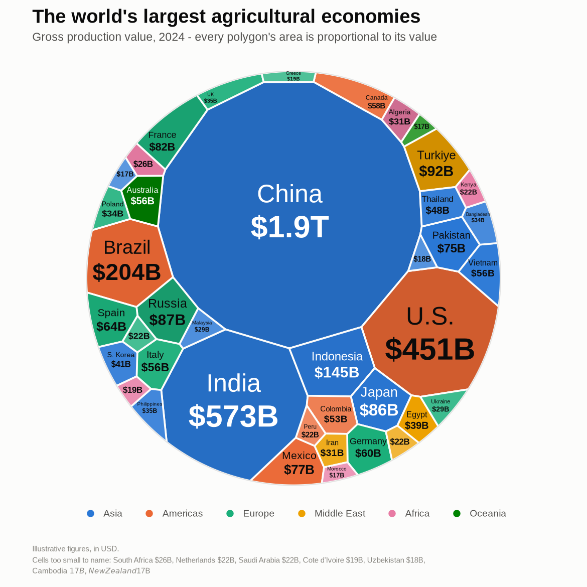

# Circle area chart (Voronoi treemap)

Give it a list of numbers, get back a circle carved into polygons whose **areas
are proportional to the numbers** — the layout used by "share of the world's X"
infographics.



```bash
python circle_area_chart.py --demo -o demo.png
```

## In a browser (phone included)

`area_circles.html` is the same layout ported to JavaScript in one self-contained
file — no build step, no network. Open it directly, type numbers, and download
the result as a PNG. Tap any cell to name it.

## Use it

```python
from circle_area_chart import circle_area_chart

fig, ax = circle_area_chart([5, 3, 2, 8, 1])
fig.savefig("chart.png", facecolor=fig.get_facecolor())
```

With names, groups and a headline:

```python
fig, ax = circle_area_chart(
    values=[1900, 573, 451, 204, 145],
    labels=["China", "India", "U.S.", "Brazil", "Indonesia"],
    groups=["Asia", "Asia", "Americas", "Americas", "Asia"],
    title="Agricultural production",
    subtitle="Area is proportional to value",
    prefix="$", suffix="B",
)
```

From the command line:

```bash
python circle_area_chart.py 5 3 2 8 1 -o chart.png
python circle_area_chart.py 40 30 20 10 --labels A,B,C,D --percent --theme dark
python circle_area_chart.py --csv data.csv --title "Revenue" --prefix '$'
```

`data.csv` is `label,value[,group]`, with an optional header row.

## Options that matter

| Option | What it does |
|---|---|
| `labels`, `groups` | names drawn in each cell; group adds categorical colour + a legend |
| `color_by` | `"value"` (sequential ramp, default), `"group"`, or `"single"` |
| `group_order` | pins which group gets which colour, so several charts agree |
| `theme` | `"light"` or `"dark"` — both are designed, not flipped |
| `show_percent` | label shares instead of raw values |
| `value_format` | `f(value) -> str` when `prefix`/`suffix` is not enough |
| `seed` | change it for a different (equally correct) arrangement |
| `tol` | area accuracy; `0.004` means every cell is within 0.4 % of its exact share |

`circle_area_chart` returns the matplotlib `(fig, ax)`, so titles, annotations
and saving are all yours to override. Pass `ax=` to draw into a subplot.

## How the layout works

`voronoi_treemap.py` is standalone and has no dependency on matplotlib. It
implements the additively-weighted Voronoi (power) treemap of Nocaj & Brandes,
*Computing Voronoi Treemaps* (2012):

1. build the power diagram of the current sites and weights, clipped to the circle;
2. move each site to the centroid of its cell (Lloyd relaxation — this is what
   makes the cells look organic rather than shattered);
3. Newton step on each weight to correct its cell's area. Raising `w_i` pushes
   every shared edge out by `dw / (2 d_ij)`, so the exact derivative is
   `dA_i/dw_i = Σ len_ij / (2 d_ij)` — which is why edges are tagged with the
   neighbour that created them during clipping;
4. clamp the weights so `w_i - w_j <= d_ij²`, which guarantees no site loses its
   cell.

It repeats until the worst cell is within `tol` of its target area. Layouts also
depend on where the sites started, so it tries a few seeds (`attempts=3`) and
keeps the best-shaped result — accuracy first, then the fewest splinter-shaped
cells.

```python
from voronoi_treemap import voronoi_treemap

result = voronoi_treemap([5, 3, 2], radius=1.0)
result.cells       # one (m, 2) polygon per value
result.areas       # achieved areas
result.max_error   # worst relative area error
```

It takes any convex `boundary=` polygon, not just a circle.

## Reading the chart

* **Area is the quantity.** Both other channels are redundant on purpose:
  colour is a sequential ramp of the same value (`color_by="value"`), and every
  cell carries its number.
* **Group colours** use a fixed, colour-blind-validated slot order, tinted
  within each group so neighbours stay apart. A 9th group is never given a
  generated hue — the tail folds into a neutral "Other".
* **Labels are fitted, not guessed**: each cell's largest inscribed circle
  (Mapbox's *polylabel*) sets the anchor, then the text grows into the cell
  shape. A cell too small for its name is listed under the chart, so nothing is
  identified by colour alone.

## Tests

```bash
python test_circle_area_chart.py
```

Checks that areas match their targets, cells tile the circle without gaps or
overlaps, layouts are reproducible, and no label overflows its cell.

## Cost

Roughly 3 s for 40 values and 25 s for 150 (three attempts, pure numpy). Pass
`attempts=1` to make it about three times faster, or raise `tol` to stop sooner.
